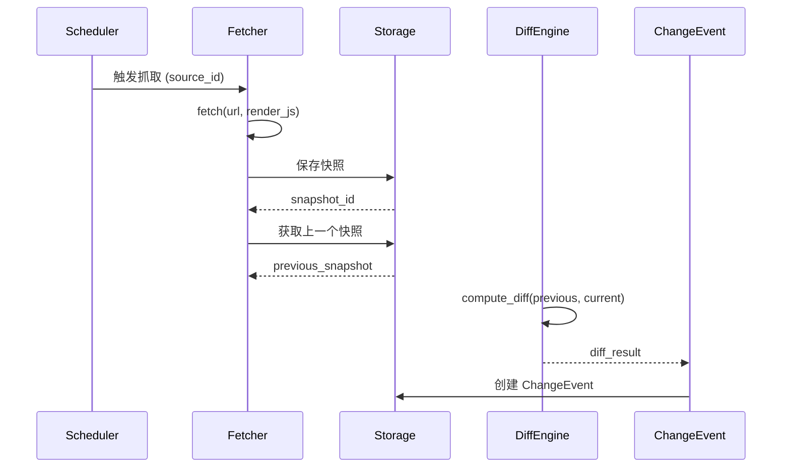
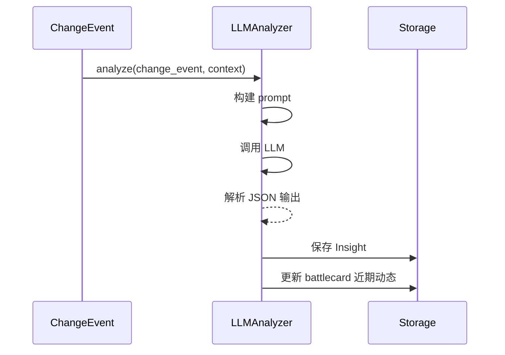

# AI 竞品情报调研平台 - 技术方案

## 1. 系统架构

### 1.1 整体架构图

```
┌─────────────────────────────────────────────────────────────┐
│                    竞品情报调研平台                          │
├─────────────────────────────────────────────────────────────┤
│  前端层 (Web UI)                                            │
│  - 竞品管理面板                                              │
│  - 变更事件流                                                │
│  - Battlecard 编辑/查看                                      │
│  - 订阅配置                                                  │
├─────────────────────────────────────────────────────────────┤
│  API 层 (FastAPI)                                           │
│  - RESTful API                                              │
│  - Webhook 回调                                             │
│  - 认证/授权                                                 │
├─────────────────────────────────────────────────────────────┤
│  业务层                                                     │
│  ├── 竞品管理服务                                            │
│  ├── 监控调度服务                                            │
│  ├── 抓取服务                                                │
│  ├── 变更检测服务                                            │
│  ├── AI 洞察服务                                            │
│  └── Battlecard 服务                                        │
├─────────────────────────────────────────────────────────────┤
│  基础设施层                                                  │
│  ├── PostgreSQL (元数据)                                    │
│  ├── 对象存储 (快照/截图)                                    │
│  ├── LLM 服务 (OpenAI/本地)                                 │
│  └── 消息队列 (Celery Redis)                                 │
└─────────────────────────────────────────────────────────────┘
```

### 1.2 核心模块

#### 1.2.1 Scheduler（调度器）
```python
# 负责定时触发抓取任务
class MonitorScheduler:
    def start(self):
        # 按配置的 schedule 触发抓取
        pass
    
    def add_task(self, source_id, cron_expr):
        # 添加/更新抓取任务
        pass
```

#### 1.2.2 Fetcher（抓取器）
```python
class Fetcher:
    def fetch(self, url, render_js=False):
        # HTTP 请求 + 可选 JS 渲染
        pass
    
    def extract_content(self, html):
        # 使用 Readability + 自定义规则提取正文
        pass
```

#### 1.2.3 Diff Engine（变更检测）
```python
class DiffEngine:
    def compute_diff(self, old_text, new_text):
        # 文本差异计算
        pass
    
    def detect_structural_changes(self, old_html, new_html):
        # 结构化字段变更检测（价格、版本号等）
        pass
```

#### 1.2.4 LLM Analyzer（AI 洞察）
```python
class LLMAnalyzer:
    def analyze_change(self, change_event, context):
        # 分析变更类型、影响、意图、建议动作
        # 必须输出 evidence 引用
        pass
```

## 2. 数据存储设计

### 2.1 PostgreSQL Schema

```sql
-- 竞品表
CREATE TABLE competitors (
    id UUID PRIMARY KEY DEFAULT gen_random_uuid(),
    name VARCHAR(255) NOT NULL,
    website VARCHAR(500),
    category VARCHAR(100),  -- LLM/Agent/工具/平台
    tags TEXT[],            -- 标签数组
    owner_team VARCHAR(100),
    created_at TIMESTAMP DEFAULT NOW(),
    updated_at TIMESTAMP DEFAULT NOW()
);

-- 监控源表
CREATE TABLE sources (
    id UUID PRIMARY KEY DEFAULT gen_random_uuid(),
    competitor_id UUID REFERENCES competitors(id),
    url VARCHAR(500) NOT NULL,
    source_type VARCHAR(50),  -- homepage/pricing/changelog/docs
    fetch_mode VARCHAR(20) DEFAULT 'http',  -- http/headless
    schedule VARCHAR(100) DEFAULT '0 8 * * *',  -- Cron 表达式
    sensitivity VARCHAR(20) DEFAULT 'medium',  -- low/medium/high
    is_active BOOLEAN DEFAULT TRUE,
    created_at TIMESTAMP DEFAULT NOW()
);

-- 快照表
CREATE TABLE snapshots (
    id UUID PRIMARY KEY DEFAULT gen_random_uuid(),
    source_id UUID REFERENCES sources(id),
    fetched_at TIMESTAMP DEFAULT NOW(),
    content_hash VARCHAR(64),
    text_content TEXT,
    html_path VARCHAR(500),      -- 对象存储路径
    screenshot_path VARCHAR(500),
    created_at TIMESTAMP DEFAULT NOW()
);

-- 变更事件表
CREATE TABLE change_events (
    id UUID PRIMARY KEY DEFAULT gen_random_uuid(),
    source_id UUID REFERENCES sources(id),
    from_snapshot_id UUID REFERENCES snapshots(id),
    to_snapshot_id UUID REFERENCES snapshots(id),
    diff_summary TEXT,
    diff_chunks JSONB,
    is_processed BOOLEAN DEFAULT FALSE,
    created_at TIMESTAMP DEFAULT NOW()
);

-- AI 洞察表
CREATE TABLE insights (
    id UUID PRIMARY KEY DEFAULT gen_random_uuid(),
    change_event_id UUID REFERENCES change_events(id),
    change_type VARCHAR(50),    -- feature/pricing/packaging/narrative/channel/compliance
    impact VARCHAR(20),         -- high/medium/low
    rationale TEXT,
    suggested_actions TEXT,
    evidence JSONB,             -- [{片段, url, 时间}]
    created_at TIMESTAMP DEFAULT NOW()
);

-- Battlecard 表
CREATE TABLE battlecards (
    id UUID PRIMARY KEY DEFAULT gen_random_uuid(),
    competitor_id UUID REFERENCES competitors(id),
    version INTEGER DEFAULT 1,
    content_md TEXT,
    updated_at TIMESTAMP DEFAULT NOW()
);

-- 订阅表
CREATE TABLE subscriptions (
    id UUID PRIMARY KEY DEFAULT gen_random_uuid(),
    user_id VARCHAR(100),
    target_type VARCHAR(20),    -- competitor/category
    target_id UUID,
    notify_type VARCHAR(20),    -- realtime/weekly
    channel VARCHAR(20),        -- email/webhook
    is_active BOOLEAN DEFAULT TRUE,
    created_at TIMESTAMP DEFAULT NOW()
);

-- 反馈表（用于去噪）
CREATE TABLE feedbacks (
    id UUID PRIMARY KEY DEFAULT gen_random_uuid(),
    change_event_id UUID REFERENCES change_events(id),
    user_id VARCHAR(100),
    is_useful BOOLEAN,
    created_at TIMESTAMP DEFAULT NOW()
);
```

## 3. API 设计

### 3.1 竞品管理
```
GET    /api/v1/competitors              # 列表
POST   /api/v1/competitors              # 创建
GET    /api/v1/competitors/{id}         # 详情
PUT    /api/v1/competitors/{id}         # 更新
DELETE /api/v1/competitors/{id}         # 删除
```

### 3.2 监控源管理
```
GET    /api/v1/competitors/{id}/sources # 列表
POST   /api/v1/sources                  # 创建
PUT    /api/v1/sources/{id}             # 更新
DELETE /api/v1/sources/{id}             # 删除
POST   /api/v1/sources/{id}/test        # 测试抓取
```

### 3.3 变更事件
```
GET    /api/v1/events                    # 变更事件列表
GET    /api/v1/events/{id}               # 详情
POST   /api/v1/events/{id}/feedback      # 反馈（有用/无用）
```

### 3.4 Battlecard
```
GET    /api/v1/competitors/{id}/battlecard  # 获取
PUT    /api/v1/competitors/{id}/battlecard  # 更新
POST   /api/v1/competitors/{id}/battlecard/generate  # AI 生成
```

### 3.5 订阅管理
```
GET    /api/v1/subscriptions             # 列表
POST   /api/v1/subscriptions             # 创建
DELETE /api/v1/subscriptions/{id}        # 删除
```

## 4. 核心流程

### 4.1 抓取与变更检测流程



### 4.2 AI 洞察生成流程



## 5. 配置管理

### 5.1 配置文件 (config.yaml)

```yaml
# 数据库
database:
  host: "localhost"
  port: 5432
  name: "competitor_intel"
  user: "postgres"
  password: "postgres"

# 对象存储
storage:
  type: "local"  # local/s3
  base_path: "./data/snapshots"
  # s3:
  #   bucket: "competitor-intel"
  #   region: "us-east-1"

# LLM 配置
llm:
  provider: "openai"  # openai/local
  model: "gpt-4o"
  api_key: "${OPENAI_API_KEY}"
  temperature: 0.3
  max_tokens: 2000

# 抓取配置
scraping:
  timeout: 30
  retry_times: 3
  retry_delay: 5
  user_agent: "CompetitorIntel/1.0"
  respect_robots_txt: true
  headless_timeout: 60

# 调度配置
scheduler:
  timezone: "Asia/Shanghai"
  default_schedule: "0 8 * * *"  # 每天 8 点

# 通知配置
notification:
  email:
    smtp_host: "smtp.example.com"
    smtp_port: 587
  webhook:
    default_url: ""
```

## 6. 部署方案

### 6.1 Docker Compose

```yaml
version: '3.8'

services:
  app:
    build: .
    ports:
      - "8000:8000"
    environment:
      - DATABASE_URL=postgresql://postgres:postgres@db:5432/competitor_intel
      - REDIS_URL=redis://redis:6379/0
    depends_on:
      - db
      - redis
    volumes:
      - ./data:/app/data

  db:
    image: postgres:15
    environment:
      POSTGRES_DB: competitor_intel
      POSTGRES_USER: postgres
      POSTGRES_PASSWORD: postgres
    volumes:
      - postgres_data:/var/lib/postgresql/data

  redis:
    image: redis:7-alpine
    volumes:
      - redis_data:/data

volumes:
  postgres_data:
  redis_data:
```

## 7. 测试策略

### 7.1 测试类型
- **单元测试**：核心逻辑（Diff、LLM Analyzer）
- **集成测试**：API 端点、数据流
- **E2E 测试**：完整用户流程

### 7.2 测试覆盖率目标
- 核心模块 ≥ 80%
- API ≥ 90%
